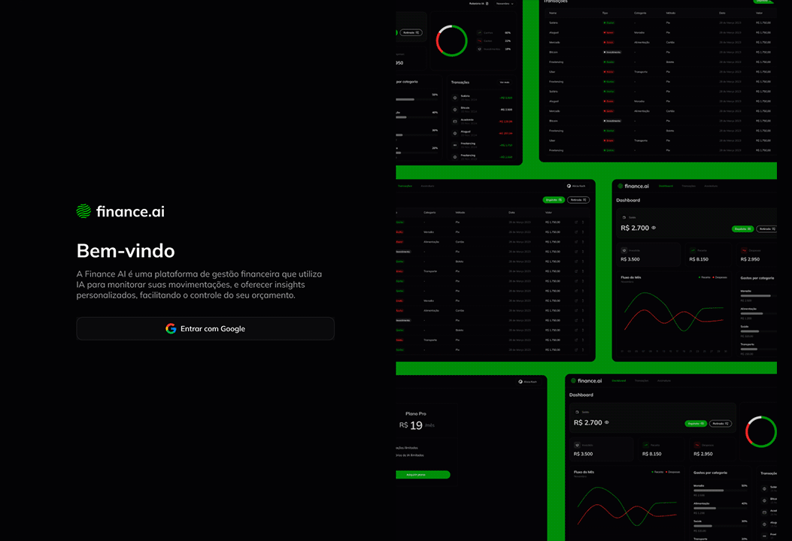

<h1 align="center">FSW 6 - Finance</h1>

  
  
  
  
  
  

  
  
  
  

 

  

 

## 💻 Projeto

Projeto de um gerenciador de finanças com funcionalidades como adição/edição/visualização de transações, login com Google, plano Premium, relatório personalizado sobre as transações gerado através de IA, entre outras. Desenvolvido durante o evento FSW 6 - Finance, da Full Stack Club.

## 🔖 Layout

Você pode visualizar o layout do projeto clicando [aqui](https://www.figma.com/design/ndIZ9nevfZZCMxCL4lZxfQ/FSW-Finance-(LIVE)?node-id=57-1074&p=f&t=n1fhNO6O3viF2LEu-0).
